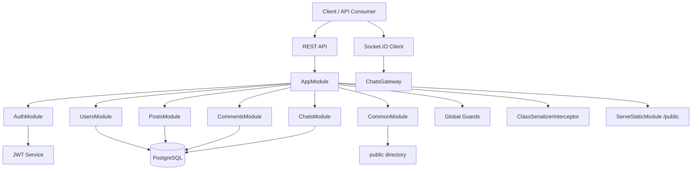
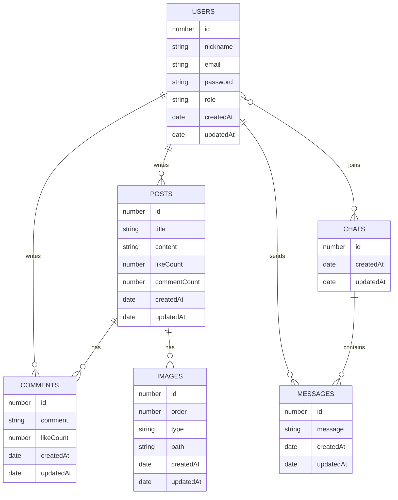
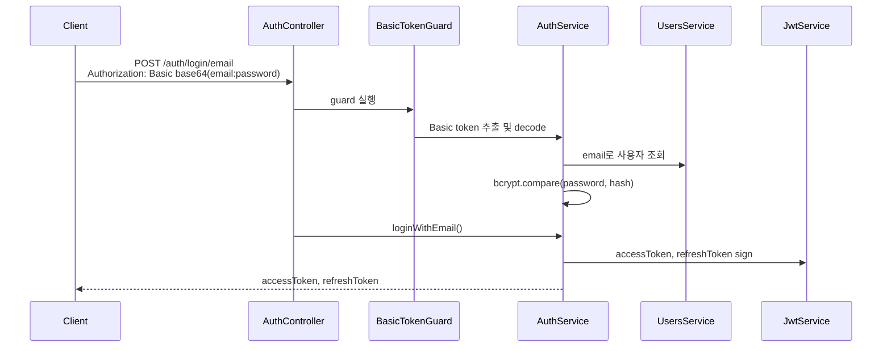
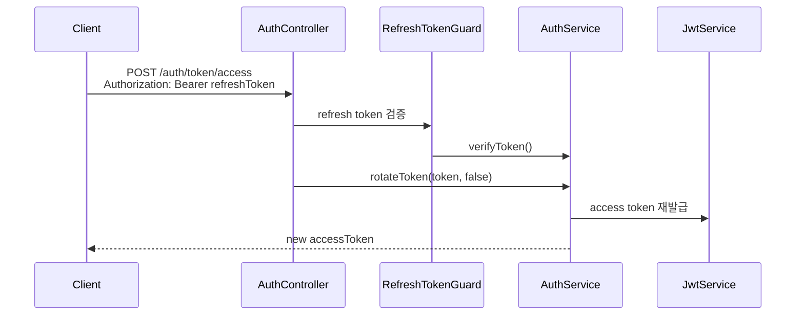
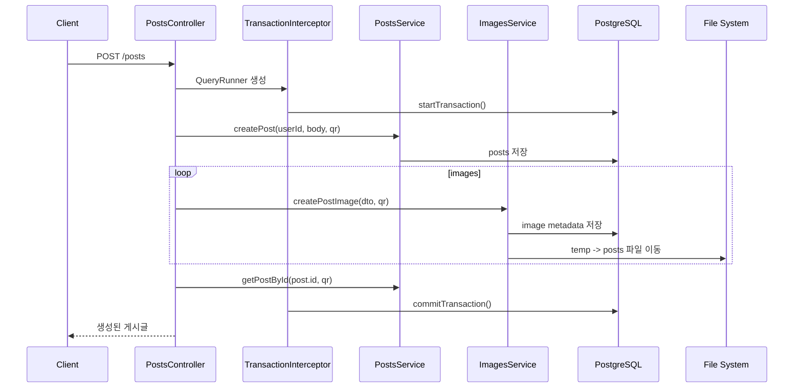
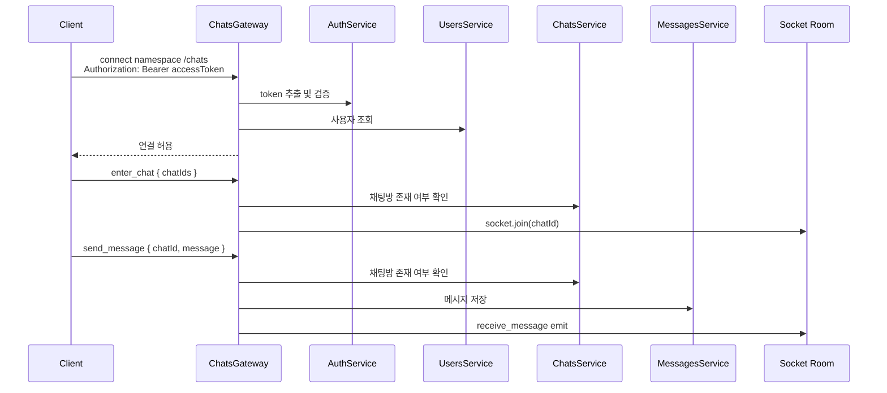

# CF_SNS

NestJS로 구현한 SNS 백엔드 학습 프로젝트입니다. 게시글, 댓글, 이미지 업로드, JWT 인증/인가, 역할 기반 권한 제어, Socket.IO 기반 실시간 채팅을 구현하면서 NestJS의 핵심 구성 요소와 TypeScript 타입 설계를 직접 적용했습니다.

기능 구현에 그치지 않고 각 기능을 만들면서 사용한 NestJS/TypeScript 개념, 설계 의도, 개선할 지점을 함께 정리했습니다.

## 기술 스택

| 구분 | 사용 기술 |
| --- | --- |
| Runtime | Node.js, TypeScript |
| Framework | NestJS 11 |
| Database | PostgreSQL, TypeORM |
| Auth | JWT, bcrypt, Basic/Bearer Token |
| Realtime | Socket.IO, `@nestjs/websockets` |
| File | Multer, `@nestjs/serve-static` |
| Validation | `class-validator`, `class-transformer` |
| Infra | Docker Compose |
| Test | Jest, Supertest |

## 주요 기능

| 도메인 | 기능 |
| --- | --- |
| Auth | 이메일 회원가입, Basic 로그인, Access/Refresh Token 발급 및 재발급 |
| User | 사용자 조회, 역할 기반 접근 제어 |
| Post | 게시글 조회, 생성, 수정, 삭제, 랜덤 게시글 생성 |
| Comment | 게시글별 댓글 조회, 생성, 수정, 삭제 |
| Image | 이미지 업로드, 확장자/용량 제한, 정적 파일 제공 |
| Pagination | page 기반 페이지네이션, cursor 기반 페이지네이션 |
| Chat | 채팅방 생성, 채팅방 입장, 메시지 저장 및 실시간 전송 |

## Architecture



`AppModule`에서 전역 설정을 집중 관리합니다. `ConfigModule`, `TypeOrmModule`, `ServeStaticModule`을 연결하고, `AccessTokenGuard`, `RolesGuard`, `ClassSerializerInterceptor`, `LogMiddleware`를 애플리케이션 전역에 적용했습니다.

## ERD



공통 필드는 `src/common/entity/base.entity.ts`의 `BaseModel`로 추상화했습니다. 각 도메인 엔티티는 TypeORM의 `ManyToOne`, `OneToMany`, `ManyToMany`, `JoinTable`을 사용해 관계를 표현합니다.

## 인증 흐름





인증은 `src/auth`에 모았습니다. 로그인은 Basic Token을 사용해 `email:password`를 전달하고, 이후 보호된 API는 Bearer Access Token을 사용합니다. Refresh Token은 토큰 재발급 엔드포인트에서만 허용하도록 `RefreshTokenGuard`로 분리했습니다.

## 게시글 생성과 트랜잭션



`src/common/interceptor/transaction.interceptor.ts`에서 요청 단위 `QueryRunner`를 만들고, `src/common/decorator/query-runner.decorator.ts`의 `@QueryRunner()`로 컨트롤러에 주입합니다. 게시글과 이미지 메타데이터 저장을 같은 트랜잭션 흐름에 묶기 위한 학습 목적의 구현입니다.

## WebSocket 채팅 흐름



`src/chats/chats.gateway.ts`에서 Socket.IO namespace를 `chats`로 분리했습니다. HTTP Guard를 그대로 붙이는 대신 handshake header의 Bearer Token을 직접 검증하고, 검증된 사용자를 `socket.user`에 저장합니다.

## NestJS / TypeScript 학습 포인트

| 개념 | 사용 위치 | 학습/설계 의도 |
| --- | --- | --- |
| Module과 DI | `AppModule`, `AuthModule`, `PostsModule`, `ChatsModule` | 도메인별 모듈을 나누고 `imports`, `providers`, `controllers`, `exports`로 의존 관계를 명확히 구성 |
| TypeORM Repository 주입 | `TypeOrmModule.forRoot`, `TypeOrmModule.forFeature` | 전역 DB 연결과 feature 단위 Repository 주입을 구분 |
| Controller-Service 계층 | `posts.controller.ts`, `posts.service.ts`, `comments.service.ts` | 요청 처리와 비즈니스 로직을 분리해 테스트와 유지보수성을 높임 |
| Guard | `AccessTokenGuard`, `RefreshTokenGuard`, `BasicTokenGuard` | Basic 로그인, Bearer 인증, Access/Refresh Token 검증 책임을 분리 |
| RBAC | `RolesGuard`, `@Roles()` | `ADMIN`, `USER` 역할에 따라 API 접근 제어 |
| Resource Ownership Guard | `IsPostMineOrAdminGuard`, `IscommentMineOrAdminGuard` | 작성자 또는 관리자만 수정/삭제할 수 있도록 리소스 소유권 검사 |
| Custom Metadata | `@IsPublic()`, `@Roles()` | `SetMetadata`와 `Reflector`를 사용해 라우트별 인증/권한 정책 선언 |
| Custom Param Decorator | `@User()`, `@QueryRunner()` | `req.user`, `req.queryRunner`를 컨트롤러 파라미터로 안전하게 주입 |
| ValidationPipe | `main.ts` | DTO 기반 검증, 암묵적 타입 변환, whitelist, 비허용 필드 차단 적용 |
| Mapped Types | `RegisterUserDto`, `CreatePostDto`, `UpdatePostDto` | `PickType`, `PartialType`으로 Entity/DTO 타입 재사용 |
| Interceptor | `TransactionInterceptor` | 요청 흐름 전후에 트랜잭션 시작, commit, rollback 처리 |
| Middleware | `LogMiddleware` | 모든 HTTP 요청의 method, url, timestamp 기록 |
| Exception Filter | `HttpExceptionFilter`, `SocketCatchHttpExceptionFilter` | HTTP와 WebSocket에서 다른 에러 응답 형태를 다루는 구조 학습 |
| Serialization | `ClassSerializerInterceptor`, `@Exclude` | 응답 변환 시 password 필드 노출 방지 |
| Entity Relation | `UsersModel`, `PostsModel`, `CommentsModel`, `ChatsModel` | `ManyToOne`, `OneToMany`, `ManyToMany`, `JoinTable` 관계 설계 |
| Generic Pagination | `CommonService.paginate<T extends BaseModel>()` | 여러 엔티티에 재사용 가능한 page/cursor 페이지네이션 구현 |
| File Upload | `MulterModule`, `FileInterceptor` | 이미지 확장자 제한, 5MB 제한, UUID 파일명 저장 |
| Static Serving | `ServeStaticModule` | `/public` 경로로 업로드 파일 제공 |
| WebSocket Gateway | `ChatsGateway` | Gateway lifecycle, room join, event emit, socket context 사용 |
| TypeScript Decorator 설정 | `tsconfig.json` | `experimentalDecorators`, `emitDecoratorMetadata`로 NestJS DI와 metadata 활용 |
| TypeScript 타입 기능 | `TokenPayload`, `keyof UsersModel`, Generic, Optional Property | union literal type, generic constraint, 객체 키 타입 추론을 실제 코드에 적용 |

### Guard와 Public Route 설계

`AppModule`에서 `AccessTokenGuard`를 전역 Guard로 등록했기 때문에 기본적으로 모든 API는 인증이 필요합니다. 공개 API는 `@IsPublic()` 데코레이터로 명시합니다.

```ts
@Get()
@IsPublic()
getPosts(@Query() query: PaginatePostDto) {
  return this.postsService.paginatePosts(query);
}
```

이 구조는 인증이 필요한 API를 매번 표시하는 방식보다 실수로 보호되지 않은 API가 생길 가능성을 줄입니다. 동시에 회원가입, 로그인, 게시글 조회처럼 공개되어야 하는 API는 의도를 명시적으로 드러냅니다.

### DTO와 Validation

전역 `ValidationPipe`는 다음 옵션을 사용합니다.

| 옵션 | 목적 |
| --- | --- |
| `transform: true` | query/body 값을 DTO 타입으로 변환 |
| `enableImplicitConversion: true` | `@Type()` 없이도 가능한 범위에서 암묵적 타입 변환 |
| `whitelist: true` | DTO에 정의되지 않은 필드 제거 |
| `forbidNonWhitelisted: true` | 허용되지 않은 필드가 들어오면 에러 발생 |

DTO는 NestJS mapped type을 사용해 중복을 줄였습니다.

```ts
export class RegisterUserDto extends PickType(UsersModel, [
  'nickname',
  'email',
  'password',
]) {}

export class UpdatePostDto extends PartialType(CreatePostDto) {}
```

### Pagination 설계

`CommonService`는 page 기반과 cursor 기반 페이지네이션을 공통화합니다.

```ts
paginate<T extends BaseModel>(
  dto: BasePaginationDto,
  repository: Repository<T>,
  overrideFindOptions: FindManyOptions<T> = {},
  path: string,
)
```

`where__id__more_than`, `where__id__less_than`, `order__createdAt` 같은 query naming convention을 TypeORM의 `FindManyOptions`로 변환합니다. 이 구조를 통해 게시글, 댓글, 채팅 등 여러 엔티티에서 같은 페이지네이션 로직을 재사용할 수 있습니다.

### 보안 관련 구현

| 항목 | 구현 |
| --- | --- |
| 비밀번호 저장 | `bcrypt.hash()`로 해시 후 저장 |
| 비밀번호 검증 | `bcrypt.compare()`로 입력값과 해시 비교 |
| 응답 보안 | `@Exclude({ toPlainOnly: true })`로 password 응답 제외 |
| JWT payload | `email`, `sub`, `type: 'access' \| 'refresh'` |
| Access Token | 짧은 만료 시간으로 API 접근에 사용 |
| Refresh Token | 토큰 재발급에만 사용 |
| 권한 제어 | `RolesGuard`, 리소스 소유권 Guard |

## API 요약

### Auth

| Method | Endpoint | 인증 | 설명 |
| --- | --- | --- | --- |
| POST | `/auth/register/email` | Public | 이메일 회원가입 후 토큰 발급 |
| POST | `/auth/login/email` | Basic | 이메일/비밀번호 로그인 |
| POST | `/auth/token/access` | Refresh Bearer | Access Token 재발급 |
| POST | `/auth/token/refresh` | Refresh Bearer | Refresh Token 재발급 |

### Users

| Method | Endpoint | 인증 | 설명 |
| --- | --- | --- | --- |
| GET | `/users` | ADMIN | 전체 사용자 조회 |

### Posts

| Method | Endpoint | 인증 | 설명 |
| --- | --- | --- | --- |
| GET | `/posts` | Public | 게시글 목록 조회, pagination 지원 |
| GET | `/posts/:id` | Public | 게시글 단건 조회 |
| POST | `/posts` | Access Token | 게시글 생성 |
| POST | `/posts/random` | Access Token | 테스트용 랜덤 게시글 생성 |
| PATCH | `/posts/:postId` | 작성자 또는 ADMIN | 게시글 수정 |
| DELETE | `/posts/:id` | ADMIN | 게시글 삭제 |

### Comments

| Method | Endpoint | 인증 | 설명 |
| --- | --- | --- | --- |
| GET | `/posts/:postId/comments` | Public | 게시글별 댓글 목록 조회 |
| GET | `/posts/:postId/comments/:commentId` | Public | 댓글 단건 조회 |
| POST | `/posts/:postId/comments` | Access Token | 댓글 생성 |
| PATCH | `/posts/:postId/comments/:commentId` | 작성자 또는 ADMIN | 댓글 수정 |
| DELETE | `/posts/:postId/comments/:commentId` | 작성자 또는 ADMIN | 댓글 삭제 |

### Common

| Method | Endpoint | 인증 | 설명 |
| --- | --- | --- | --- |
| POST | `/common/image` | Access Token | 이미지 업로드 |
| GET | `/public/...` | Public | 정적 파일 조회 |

### Socket.IO

| Namespace | Event | 설명 |
| --- | --- | --- |
| `/chats` | `create_chat` | 사용자 id 목록으로 채팅방 생성 |
| `/chats` | `enter_chat` | 채팅방 id 목록에 socket room join |
| `/chats` | `send_message` | 메시지 저장 후 room에 `receive_message` 전송 |
| `/chats` | `receive_message` | 클라이언트가 수신하는 메시지 이벤트 |

## 실행 방법

### 1. 환경 변수 설정

프로젝트 루트에 `.env` 파일을 생성합니다.

```env
PROTOCOL=http
HOST=localhost:3000
JWT_SECRET=change-me
HASH_ROUNDS=10

DB_HOST=localhost
DB_PORT=5432
DB_USERNAME=postgres
DB_PASSWORD=postgres
DB_DATABASE=cf_sns
```

### 2. PostgreSQL 실행

```bash
docker compose up -d
```

### 3. 의존성 설치

```bash
yarn install
```

### 4. 개발 서버 실행

```bash
yarn start:dev
```

기본 포트는 `3000`입니다.

### 5. 테스트와 빌드

```bash
yarn test
yarn test:e2e
yarn build
```

Windows PowerShell에서 `yarn.ps1` 실행 정책 문제가 발생하면 `yarn.cmd`를 사용할 수 있습니다.

```bash
yarn.cmd test --runInBand
yarn.cmd build
```

## 구현하면서 학습한 점

이 프로젝트는 완성형 서비스보다 NestJS 백엔드 핵심 개념을 직접 구현해보는 데 목적을 두었습니다. 기능을 만들면서 특히 다음 흐름을 중점적으로 학습했습니다.

- 전역 Guard를 먼저 적용하고 `@IsPublic()`로 공개 API를 예외 처리하는 방식
- `SetMetadata`와 `Reflector`를 활용한 선언형 권한 제어
- `createParamDecorator`로 request context를 컨트롤러에 주입하는 방식
- `QueryRunner`를 request에 주입해 트랜잭션 범위를 컨트롤러와 서비스에 전달하는 방식
- DTO와 Entity를 mapped type으로 재사용하며 중복을 줄이는 방식
- Generic 기반 페이지네이션으로 도메인별 중복 로직을 공통화하는 방식
- HTTP와 WebSocket에서 인증 흐름이 달라지는 지점을 직접 구현한 방식

## 개선 과제

| 항목 | 현재 상태 | 개선 방향 |
| --- | --- | --- |
| DB schema 관리 | `synchronize: true` 사용 | 운영 환경에서는 TypeORM migration으로 전환 |
| 테스트 | 기본 spec 중심 | Auth, Guard, Pagination, Transaction, WebSocket e2e 테스트 보강 |
| 에러 응답 | 일부 메시지와 필터 구현 | HTTP/WebSocket 공통 에러 코드 체계 정리 |
| 파일 저장 원자성 | DB 저장과 파일 이동을 함께 수행 | 파일 이동 실패 시 DB rollback 또는 보상 트랜잭션 전략 추가 |
| 채팅 권한 | 채팅방 존재 여부 확인 | 해당 사용자가 채팅방 참여자인지 추가 검증 |
| 타입 엄격성 | `noImplicitAny: false` | 점진적으로 `strict` 옵션 강화 |
| API 문서화 | README 표 중심 | Swagger 또는 OpenAPI 문서 추가 |

현재 프로젝트는 NestJS 학습 과정에서 다양한 프레임워크 기능을 직접 실험한 결과물입니다. Guard, Decorator, Interceptor, DTO, TypeORM Relation, WebSocket Gateway를 각각 따로 보는 데서 끝내지 않고 실제 API 흐름 안에서 연결해보는 데 초점을 맞췄습니다.
